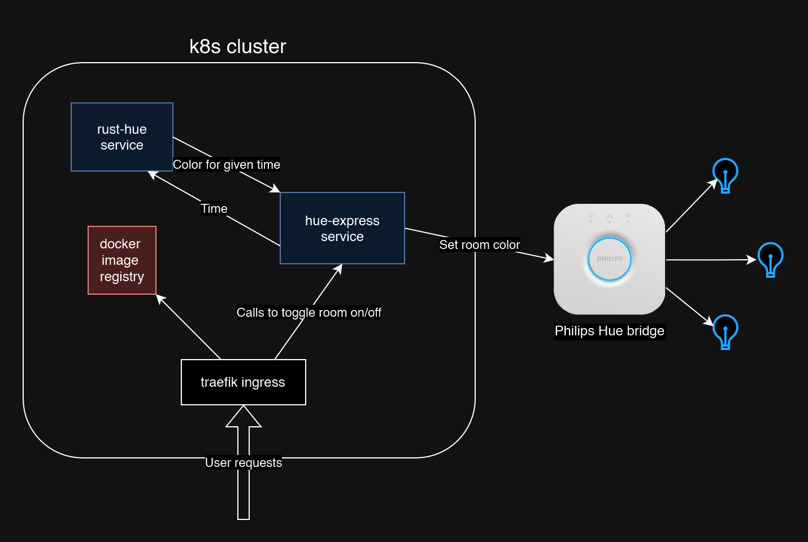

# hue-blend

This is my project to:

1. Learn Rust.
2. Refresh my k8s knowledge.
3. Have a constantly running script that makes imperceptibly minute changes to my Hue lights so that they slowly turn yellow after sunset.

## What this repo contains

- Rust server to tell me what the color for a given time should be. (Color = color temperature + brightness)
- Node service that will update the Hue bridge with the desired color periodically. Contains express service to allow changing colors for whole rooms with API calls.
- Private registry to hold images of Rust server and Node service.
	- Charts to update the IP address of the private registry. This ensures that docker doesn't complain about an insecure registry.
	- Service to update the TLS certificate from Let's Encrypt.
- Traefik ingress to route traffic to rust service, node service, registry, etc.
- Helm chart to deploy rust service, node service, and dependency charts.

## Diagram

